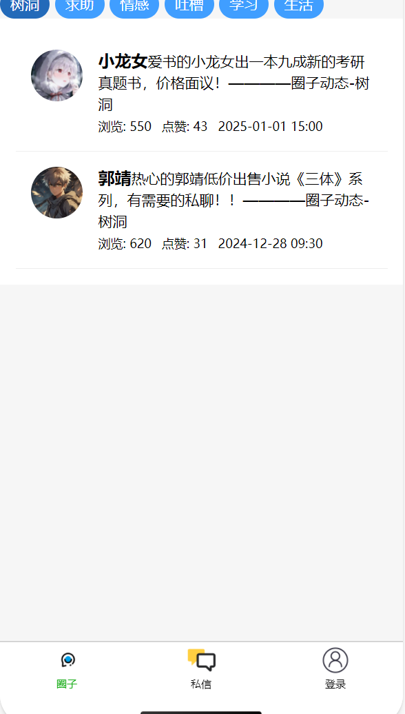
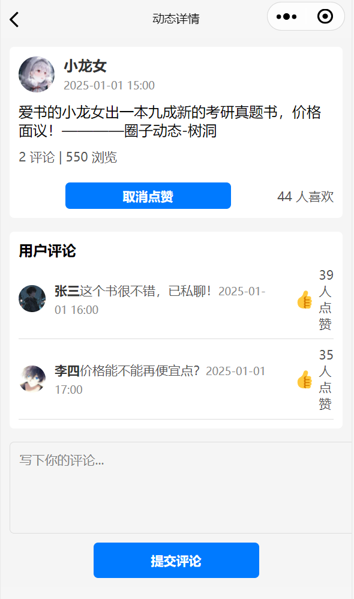

# 简介
一个校园交友、二手交易、找搭子的小程序  
这只是一个微信小程序前端，后端还未开始  

# 快速部署启动  
1. 下载源码，解压到项目文件夹  
git clone https://github.com/gewei11/school_system.git  
2. 在微信开发者工具中打开项目文件夹  
3. 下载环境  
npm install -i  
4. 启动node.js虚拟后端  
cd .\miniprogram\utils\  
node server.js  
5. 在微信开发者工具中预览即可  

# 功能
1. 圈子模块：用户可以发布动态，查看其他用户发布的动态，评论、点赞、转发等
  
  

2. 聊天模块：用户可以与其他用户进行一对一聊天（分为粉丝和互关）

未完待续——

# 云开发 quickstart（未使用，考虑自己写后端）

这是云开发的快速启动指引，其中演示了如何上手使用云开发的三大基础能力：

- 数据库：一个既可在小程序前端操作，也能在云函数中读写的 JSON 文档型数据库
- 文件存储：在小程序前端直接上传/下载云端文件，在云开发控制台可视化管理
- 云函数：在云端运行的代码，微信私有协议天然鉴权，开发者只需编写业务逻辑代码

## 参考文档

- [云开发文档](https://developers.weixin.qq.com/miniprogram/dev/wxcloud/basis/getting-started.html)
